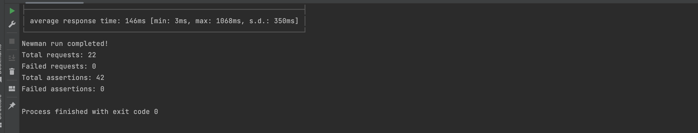
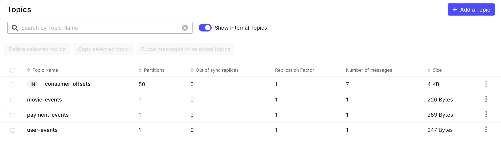
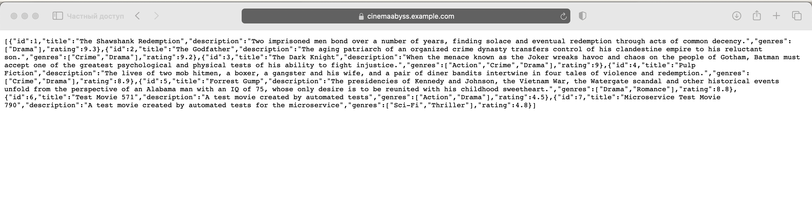
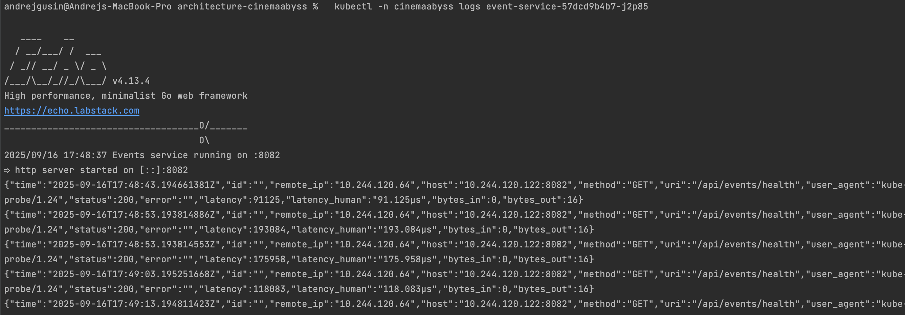
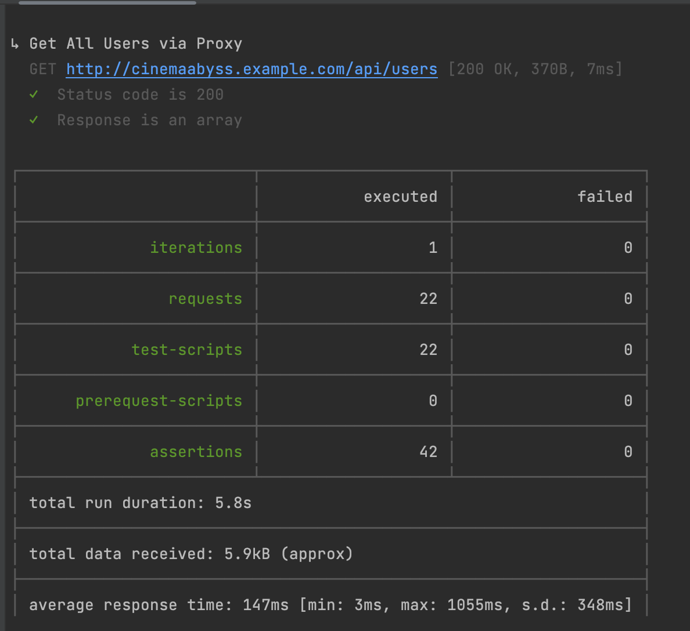
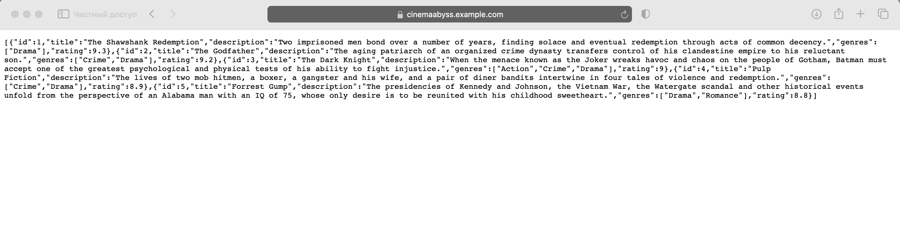
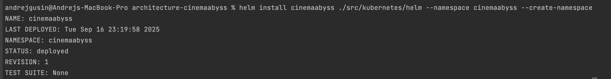

## Изучите [README.md](./README-описание.md) файл и структуру проекта.

# Задание 1

1. Спроектируйте to be архитектуру КиноБездны, разделив всю систему на отдельные домены и организовав интеграционное взаимодействие и единую точку вызова сервисов.
Результат представьте в виде контейнерной диаграммы в нотации С4.
Добавьте ссылку на файл в этот шаблон
[Контейнерная диаграмма в нотации С4](docs/c4/ContainerDiagram.puml)

# Задание 2

### 1. Proxy
Реализуйте сервис на любом языке программирования в ./src/microservices/proxy.

### 2. Kafka

Сделать MVP сервис events

# Задание 3

Команда начала переезд в Kubernetes для лучшего масштабирования и повышения надежности. 
Вам, как архитектору осталось самое сложное:
 - реализовать CI/CD для сборки прокси сервиса
 - реализовать необходимые конфигурационные файлы для переключения трафика.

### CI/CD

Успешным результатом данного шага является "зеленая" сборка и "зеленые" тесты

### Proxy в Kubernetes

Откройте логи event-service и сделайте скриншот обработки событий

Добавьте сюда скриншота вывода при вызове https://cinemaabyss.example.com/api/movies и скриншот вывода event-service после вызова тестов.

# Задание 4

Потом вызовите 
https://cinemaabyss.example.com/api/movies
и приложите скриншот развертывания helm и вывода https://cinemaabyss.example.com/api/movies

